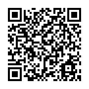

# Line bot powered by OLAMI and KKBOX

A Line bot understands Chinese, because [OLAMI](https://tw.olami.ai/) is behind the scene to read what you typed.
It's only been tested on Python 3.6, but should also support Python 3.5.

## Try it out!

Use this Line QR code to add the bot:

This bot currently only has *KKBOX* and *weather* modules enabled for the OLAMI service.
And since this is just for test, some debug and error messages will be directly forwarded to the user.

**Note: This Line bot is hosted on a Heroku free dyno, So if this bot is not responding,
it might reached its limited capacity. You might have to wait a while.**

## Deployment

### Credentials

You need to have credentials for both [OLAMI](https://tw.olami.ai) and
[Line Message API](https://developers.line.me/en/services/messaging-api/).
Follow the instructions on their website to acquire the following information
for your chat bot:

* Line Channel Secret
* Line Channel Access Token
* OLAMI App Key
* OLAMI App Secret

### Configurations

Environment variables are used to configure the system. Make sure you have exported the following environment variables:

| Name | Description |
| ---- | ----------- |
| `FLASK_ENV` | The value should be `production` for production environment. |
| `LINE_CHANNEL_ACCESS_TOKEN` | Your Line channel access token.  |
| `LINE_CHANNEL_SECRET` | Your Line channel secret. |
| `OLAMI_APP_KEY` | Your OLAMI service app key. |
| `OLAMI_APP_SECRET` | Your OLAMI service app secret. |

### Hosting the bot service

Line Message API requires the server hosting the bot service to use
[HTTPS and SSL certificate issued by an authorized certificate authority (CA)](https://developers.line.me/en/docs/messaging-api/building-bot/#set-a-webhook-url).
So it is recommended to use PaaS services like Heroku to deploy the bot.
This repo has a [`Procfile`](./Procfile) included, so deploy it to Heroku should works out of the box.

## Development

The development environment is managed by [Pipenv](https://docs.pipenv.org/), so be sure you are familiar with it.

### Environment variables

For development environment, set up the following environment variables:

| Name | Description |
| ---- | ----------- |
| `FLASK_ENV` | The value should be `development` for development environment. |
